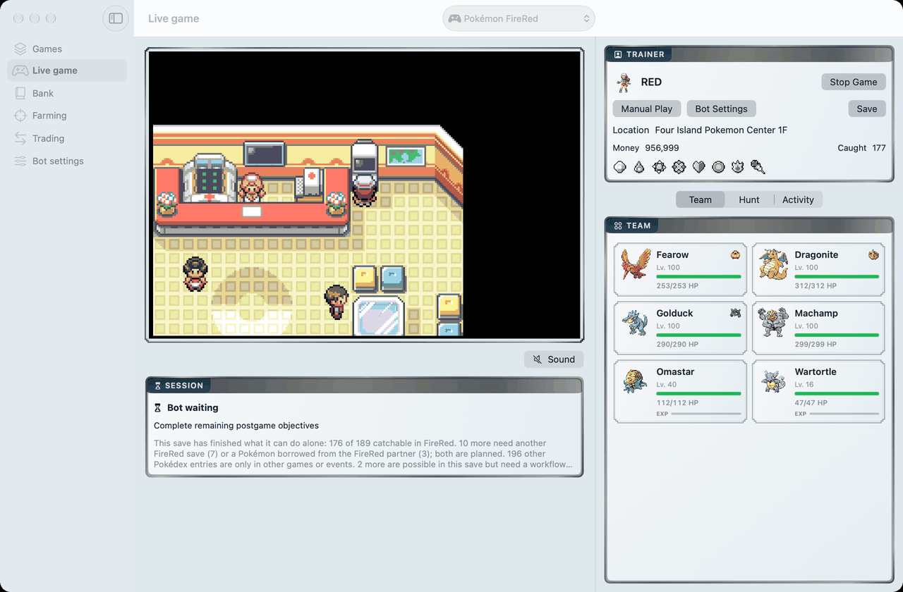
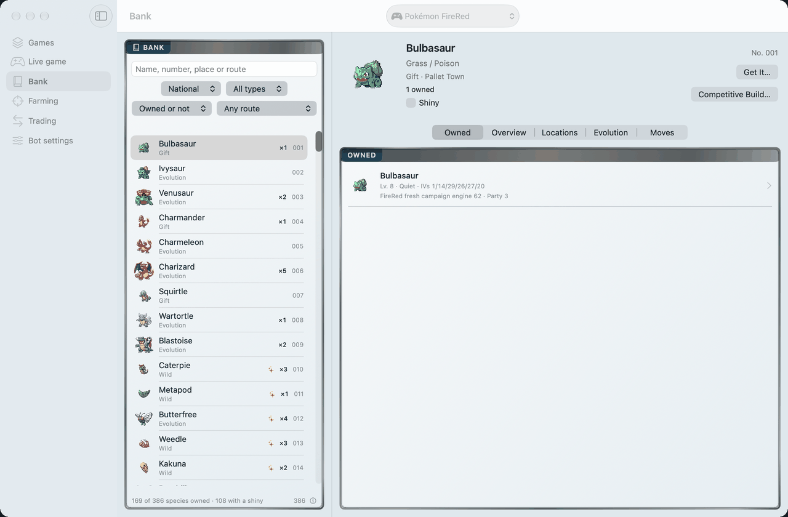
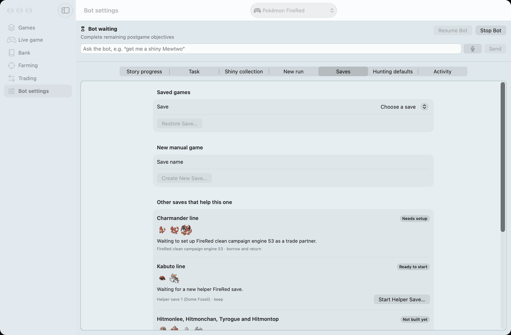
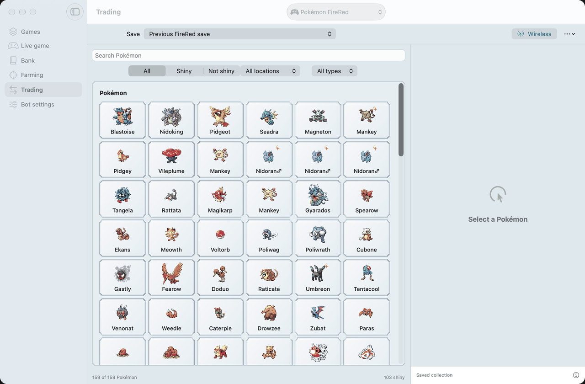
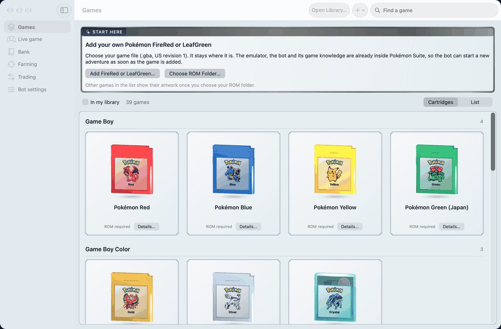
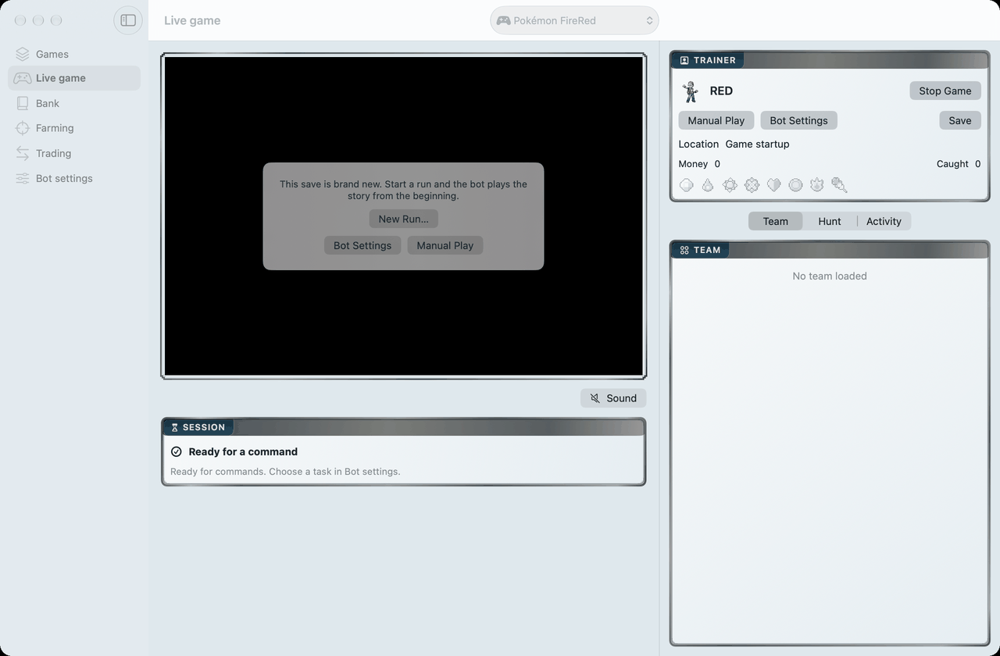
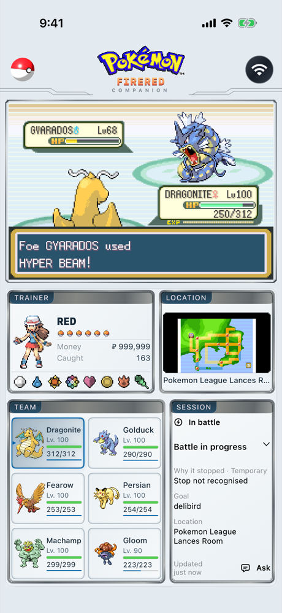
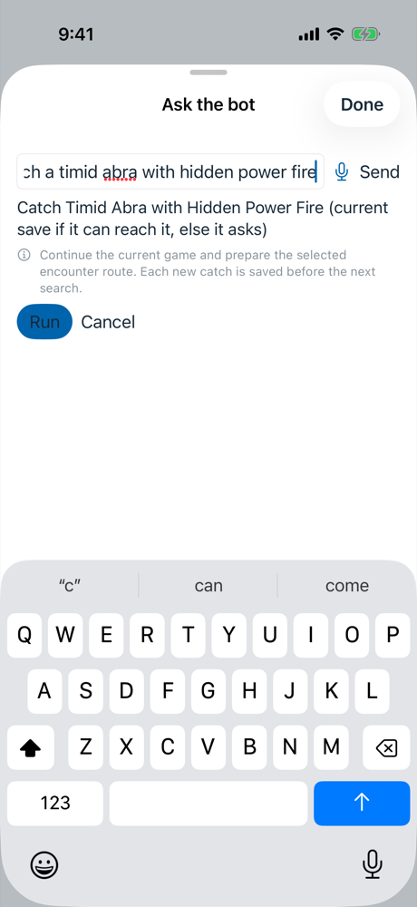
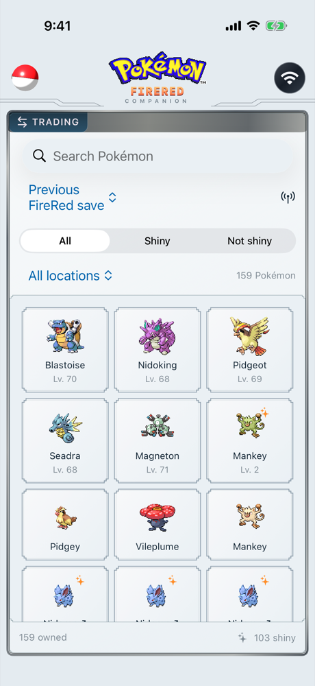

<p align="center">
  
</p>

<h1 align="center">Pokémon Suite</h1>

<p align="center">
  <b>A free Mac app that plays Pokémon FireRed and LeafGreen for you</b>, using nothing but controller input.<br>
  Bring your own ROM, ask for what you want in plain words, and watch it play. It can even trade with a real Nintendo Switch.
</p>

<p align="center">
  <a href="../../releases/latest"></a>
  
  <a href="LICENSE"></a>
  
</p>

<p align="center">
  <a href="../../releases/latest"><b>Download for Mac</b></a> ·
  <a href="#quick-start">Quick start</a> ·
  <a href="#trade-with-a-nintendo-switch">Trade with a Switch</a> ·
  <a href="#iphone-and-ipad">iPhone and iPad</a> ·
  <a href="docs/">Documentation</a>
</p>

<p align="center">
  <picture>
    <source media="(prefers-color-scheme: dark)" srcset="docs/images/mac-live-dark.png">
    
  </picture>
  <br>
  <sub><em>The bot playing FireRed on a Mac. <a href="https://github.com/sbenson2/pokemon-suite/releases/download/v0.1.0/pokemon-suite-promo.mp4">Watch a one-minute video</a> of an earlier version beating the Champion.</em></sub>
</p>

## What it is

Pokémon Suite runs the game in a built-in copy of the [mGBA](https://mgba.io) emulator and plays it the way a person with a controller would: it reads the screen state, decides, and presses buttons. It doesn't write to game memory, patch the ROM or edit saves. A catch, trade or evolution only counts once it's in the game's own save file.

Tell it what you want, typed or spoken: *"play the story"*, *"get me a shiny Mewtwo"*, *"catch a timid Abra with Hidden Power Fire"*, *"heal my team, fly to Cinnabar and save"*. It turns that into a plan, shows it to you, and asks before anything runs.

## What it does

- **Plays the story.** From a new save it names your trainer, picks your starter and plays to the Hall of Fame: gyms, trainers, HMs, story events and shopping. FireRed and LeafGreen.
- **Works through the postgame.** The Sevii Islands, the legendaries, Trainer Tower, the Fame Checker, Unown, League rematches and the National Pokédex, picked up on its own.
- **Catches them all.** It works toward every Pokémon FireRed can catch: it fishes, breeds Pokémon to evolve them, makes the in-game trades, buys and finds evolution stones, and pushes the Ruin Valley boulders for the Sun Stone.
- **Plays your other saves too.** Some Pokémon come only once per save: the other starters, the other fossil, the other Dojo prize and the other roaming legendaries. The bot can play an extra save to get one, then trade it to your main save.
- **Hunts shinies with RNG timing.** Gen III shiny hunting by timing inputs to the frame, including nature and Hidden Power targets. Each plan is rehearsed in throwaway emulators before the real attempt.
- **Keeps a Bank.** All 386 species, the Pokémon you own in every save the app knows, and how FireRed gets each one. **Get it** asks the bot for a species with the shiny, nature, IVs and other traits you pick.
- **Trains while it fights.** In Elite Four rounds, five sweepers carry the battles while a sixth Pokémon holds the Exp. Share and never takes a hit.
- **Trades.** Between two emulated saves (for trade evolutions like Machamp and Steelix) or [with a real Nintendo Switch](#trade-with-a-nintendo-switch).
- **Plans competitive builds legitimately.** Set suggestions for every species, which traits of an owned Pokémon can still change, the in-game steps to get there, and a read-only Gen III legality check ([details](docs/COMPETITIVE-BUILDER.md)).
- **Tells you why it stopped.** When something goes wrong it keeps the save, stops, and shows what happened and what you can do about it.

<table>
  <tr>
    <td width="50%" valign="top">
      <picture>
        <source media="(prefers-color-scheme: dark)" srcset="docs/images/mac-bank-dark.png">
        
      </picture>
      <p><b>Bank.</b> Every species, what you own across saves, and a <b>Get it</b> button that asks the bot.</p>
    </td>
    <td width="50%" valign="top">
      <picture>
        <source media="(prefers-color-scheme: dark)" srcset="docs/images/mac-saves-dark.png">
        
      </picture>
      <p><b>Other saves that help this one.</b> Which save supplies each one-per-save Pokémon, and a button to start it.</p>
    </td>
  </tr>
  <tr>
    <td width="50%" valign="top">
      <picture>
        <source media="(prefers-color-scheme: dark)" srcset="docs/images/mac-trading-dark.png">
        
      </picture>
      <p><b>Trading.</b> Pick a Pokémon from any save and trade it, between saves or to a Switch.</p>
    </td>
    <td width="50%" valign="top">
      <picture>
        <source media="(prefers-color-scheme: dark)" srcset="docs/images/mac-start-dark.png">
        
      </picture>
      <p><b>Start here.</b> Add your FireRed or LeafGreen file and the bot can start a new adventure right away.</p>
    </td>
  </tr>
</table>

Every change to the bot is checked against more than 130 recorded game situations, replayed on the real emulator, before it ships. See [how that works](docs/BOT-REGRESSION-GATE.md).

## Quick start

**You need:** a Mac with Apple silicon running macOS 14 or later, and your own dump of one of these games:

| Game | File | SHA-1 |
|---|---|---|
| Pokémon FireRed | English, revision 1 ([No-Intro record](https://datomatic.no-intro.org/?page=show_record&s=23&n=1672)) | `dd5945db9b930750cb39d00c84da8571feebf417` |
| Pokémon LeafGreen | English, revision 1 ("LeafGreen Version (USA, Europe) (Rev 1)") | `7862c67bdecbe21d1d69ce082ce34327e1c6ed5e` |

The app checks the hash and won't run the bot on anything else. Everything else it needs ships inside the app: the emulator core and the game data the bot plans with. No ROMs, BIOS files, saves or game artwork are included; sprites are read from your ROM while the app runs.

1. Download `pokemon-suite-<version>-macos-arm64.zip` from the [latest release](../../releases/latest), unzip it, and move **Pokémon Suite** to your Applications folder.
2. Open it. macOS says it can't verify the developer; click **Done**. Then open **System Settings → Privacy & Security**, scroll to **Security** and click **Open Anyway** next to Pokémon Suite.
3. In **Start here**, choose **Add FireRed or LeafGreen…** and pick your ROM.
4. Press **Start Game**, then **New Run…** to have the bot play the story from the beginning. Or ask it: *"play the story"*.

> [!NOTE]
> The app isn't notarized by Apple; that needs a paid developer account, and this is a free project. You only allow it once. From Terminal instead:
> `xattr -dr com.apple.quarantine "/Applications/Pokémon Suite.app"`

<p align="center">
  <picture>
    <source media="(prefers-color-scheme: dark)" srcset="docs/images/mac-new-run-dark.png">
    
  </picture>
</p>

## Status

| | |
|---|---|
| FireRed (US, rev 1): story to the Hall of Fame | Works |
| LeafGreen (US, rev 1): story from a new game | Works with the same engine and story campaign as FireRed. A full LeafGreen run to the Hall of Fame isn't verified yet. |
| LeafGreen postgame, hunts and trades | Not yet. A LeafGreen run waits for you after the Hall of Fame. |
| FireRed postgame and "catch them all" | Works. When one save can't get a Pokémon alone, the bot says which other save it needs. |
| Other saves (helper saves, archived saves as trade partners) | Works from **Bot settings → Saves**. A roaming legendary means playing that save's postgame first, which takes hours. |
| Shiny hunting by RNG | Works for the supported encounter types |
| Emulated trades and trade evolutions | Works with a second save as the trade partner |
| Bank | Works for FireRed. Reads saves only. |
| Trading with a Switch or Switch 2 | Experimental. Tested on one Mac with a Switch 2. |
| iPhone and iPad companion | Works. You build it yourself. |
| Other Pokémon games | Library, Pokédex details and artwork only. No bot. |
| Windows and Linux | Not supported |

## Trade with a Nintendo Switch

The Mac can trade with FireRed or LeafGreen running on a real Nintendo Switch or Switch 2, over the console's local wireless, the same way two Switches trade at the Pokémon Center's Direct Corner. It's experimental: read [what's been tested](docs/HARDWARE.md#whats-been-tested) before you trade anything you care about.

**What you need**

| | |
|---|---|
| A Mac with Apple silicon | macOS 14 or later, with Pokémon Suite installed |
| **TP-Link Archer T3U** USB Wi-Fi adapter | The plain AC1300 model, USB ID `2357:012d`. **Not** the T3U Plus or T3U Nano. |
| A USB-C to USB-A adapter | The Archer has a USB-A plug; most Macs need one |
| FireRed or LeafGreen on Switch | The Nintendo eShop release. No Nintendo Switch Online membership needed. Play until the Pokémon Center's Direct Corner opens. |
| `prod.keys` from your own Switch | Only four keys from it are used. This project doesn't include keys or explain how to get them. |

The Mac's built-in Wi-Fi can't do this. The app starts a tiny Linux virtual machine only while a trade runs and hands it the Archer, whose Linux driver can speak the Switch's local wireless. [Why this adapter](docs/HARDWARE.md#why-this-adapter).

**Before your first trade**

1. Plug in the Archer and open **System Information → USB**. It should show **802.11ac NIC** with vendor ID **0x2357** and product ID **0x012d**.
2. Don't install TP-Link's Mac driver. The virtual machine brings its own.

**Trading**

1. Open **Trading** and choose **Console Keys** once to point the app at your `prod.keys`. The Wireless status tells you if anything is missing.
2. Pick a Pokémon and choose **Prepare Trade**. The bot heals, saves, walks to the Direct Corner and opens a room.
3. On the Switch, go upstairs at a Pokémon Center and join the room. Trade as usual.
4. Both games save as normal. The Mac confirms the new Pokémon is in its save before it calls the trade done.

The full guide, with troubleshooting: [docs/HARDWARE.md](docs/HARDWARE.md).

## iPhone and iPad

The iPhone and iPad app shows the live game, the team, the Bank and trades, and takes requests by voice. The game keeps running on your Mac, so closing the app never stops the bot. It connects over your home network or [Tailscale](https://tailscale.com).

<p align="center">
  
  
  
</p>

It isn't on the App Store; you build it with Xcode on your Mac. A free Apple ID is enough.

1. Install [Xcode](https://apps.apple.com/app/xcode/id497799835) and [XcodeGen](https://github.com/yonaskolb/XcodeGen): `brew install xcodegen`
2. Generate the project, with a bundle ID that's yours:
   ```sh
   python3 native/ios/build-companion.py --output build/companion --bundle-id com.yourname.pokemonsuite
   xcodegen generate --spec build/companion/project.json --project build/companion
   open build/companion/PokemonSuiteCompanion.xcodeproj
   ```
3. In Xcode, under **Signing & Capabilities**, choose your Apple ID as the **Team** for both the `PokemonSuiteCompanion` and `SuiteCore` targets.
4. Connect your iPhone or iPad, select it as the run destination, and press **Run**. The first time, turn on **Developer Mode** (Settings → Privacy & Security) and trust your Apple ID under Settings → General → VPN & Device Management.
5. On the Mac, open **Settings → Companion**, turn on sharing, copy the connection code and paste it into the app.

**With a free Apple ID the app stops opening after 7 days.** Connect the device and press Run again. A paid developer account extends that to a year.

More detail: [docs/MOBILE-COMPANION.md](docs/MOBILE-COMPANION.md).

## Building from source

Most people should use the release. The tests run without any game files:

```sh
swift test --package-path macos
python3 -m pip install -r pokemon_suite/update-requirements.txt
python3 -m unittest discover -s tests
(cd engine/firered && node --test test/*.test.js)
```

The Mac app builder only packages bot code that has passed `scripts/verify-bot.py`, which replays a corpus of recorded save states on the real emulator. My corpus stays private because the states contain game data, so a fork needs to record its own. [docs/BOT-REGRESSION-GATE.md](docs/BOT-REGRESSION-GATE.md) explains the format and [docs/MACOS.md](docs/MACOS.md) the build. The builder also needs the game resource packs (FireRed and LeafGreen) in the `game-resources` zip attached to each release.

To run just the service in a browser, you need Python 3.11+ and Node.js 22+:

```sh
python3 -m pokemon_suite serve --open
```

## Forks

This is a personal project. I'm not taking pull requests or feature requests, but the code is MIT licensed: fork it and make it yours. Security problems can be reported privately; see [SECURITY.md](SECURITY.md).

## Credits

- [mGBA](https://github.com/mgba-emu/mgba) by Jeffrey Pfau and contributors, built for the web by [mGBA-wasm](https://github.com/wasm-gaming/mGBA-wasm). MPL-2.0.
- [pret/pokefirered](https://github.com/pret/pokefirered), the FireRed decompilation the bot's map, script and battle knowledge is extracted from.
- [pokeldn](https://github.com/Decryptu/pokeldn) (formerly frlg-ldn-trade) and Kinnay's [LDN](https://github.com/kinnay/LDN) library, which the Switch trade relay is built on.
- [PokéAPI](https://github.com/PokeAPI/pokeapi) for Pokédex facts, [QEMU](https://www.qemu.org) and [Alpine Linux](https://alpinelinux.org) for the radio, and [Sparkle](https://sparkle-project.org) for updates.
- Cartridge 3D models by Bob, ewaldc2028, littlengvfx, SGLilac and maxns1980 (CC BY 4.0).

Full notices: [THIRD_PARTY_NOTICES.md](THIRD_PARTY_NOTICES.md) and [DATA_SOURCES.md](DATA_SOURCES.md).

## License

MIT for the original code. Bundled components keep their own licenses, and the complete source for the radio's GPL components is attached to every release.

<sub>Pokémon Suite is an independent fan project. It is not affiliated with, endorsed or sponsored by Nintendo, Game Freak, Creatures Inc. or The Pokémon Company. Pokémon and all related names are trademarks of their respective owners. Please don't use it to cheat other players.</sub>
