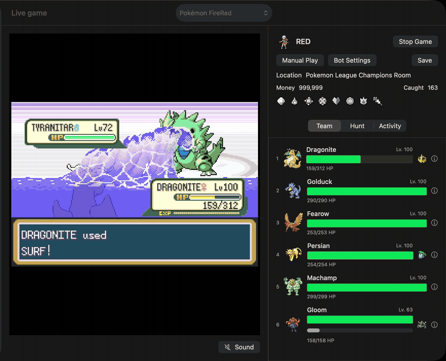

<p align="center">
  
</p>

<h1 align="center">Pokémon Suite</h1>

<p align="center">
  A Mac app that plays Pokémon FireRed for you, using nothing but controller input.<br>
  Bring your own ROM. Watch and steer it from your iPhone or iPad.
</p>

<p align="center">
  <a href="../../releases/latest"><b>Download</b></a> ·
  <a href="#iphone-and-ipad">iPhone and iPad</a> ·
  <a href="docs/HARDWARE.md">Trading with a Switch</a> ·
  <a href="docs/">Documentation</a>
</p>

<p align="center">
  
  <br>
  <sub><em>The Champion battle, played by the bot at 5× speed. <a href="../../releases/latest">Watch the one-minute video</a>. Pokémon and FireRed are trademarks of Nintendo, Creatures and Game Freak, which are not associated with this project.</em></sub>
</p>

## What it is

Pokémon Suite runs FireRed in a built-in copy of the [mGBA](https://mgba.io) emulator and plays it the way a person with a controller would: it looks at the screen state, decides, and presses buttons. It does not write to game memory, patch the ROM or edit saves. Every catch, trade and evolution only counts once it shows up in the game's own save file.

You tell it what you want in plain words, typed or spoken: *"get me a shiny Mewtwo"*, *"catch a timid Abra with Hidden Power Fire"*, *"heal my team, fly to Cinnabar and save"*. It turns that into a plan, shows it to you, and asks before anything runs.

## What it does

- **Plays the story.** From a new save it names your trainer, picks your starter and plays through to the Hall of Fame: gyms, trainers, HMs, story events and shopping.
- **Works through the postgame.** A checklist of goals it picks up on its own: the Sevii Islands, the legendaries, Trainer Tower, the Fame Checker, Unown, League rematches and the National Pokédex.
- **Trains while it fights.** In Elite Four rounds, five level 100 sweepers carry the battles while a sixth Pokémon holds the Exp. Share and never takes a hit. It stops if the trainee is ever in danger.
- **Hunts shinies with RNG timing.** Gen III shiny hunting by timing inputs to the frame, including nature and Hidden Power targets. Each plan is rehearsed in throwaway emulators before the real attempt.
- **Keeps a Bank.** One list of all 386 species with the Pokémon you own in every save the app knows, and how FireRed gets each one. **Get it** asks the bot for a species with the shiny, nature, IVs, Hidden Power, ability and gender you pick. It is the same request as typing it into Ask, so you see the plan and confirm before anything runs. An owned Pokémon in the current game can be sent to your Switch from its details.
- **Breeds and hatches eggs** at the Day Care, and waits out the steps like a player would.
- **Trades.** Link trades between two emulated saves, which is how it gets trade evolutions like Machamp and Steelix. This needs a second save set up as a trade partner (see [Status](#status)). Trading with a real Nintendo Switch works too, with an extra USB Wi-Fi adapter ([experimental](docs/HARDWARE.md)).
- **Tells you why it stopped.** When something goes wrong it keeps the save, stops, and shows what happened and what you can do about it.
- **Plans competitive builds legitimately.** Set suggestions for every species, which traits of an owned Pokémon are fixed and which can still change, the in-game steps to get there, and a read-only Gen III legality check. It never edits a save ([details](docs/COMPETITIVE-BUILDER.md)).

Every change to the bot is checked against more than 130 recorded game situations, replayed on the real emulator, before it ships. See [how that works](docs/BOT-REGRESSION-GATE.md).

## Status

| | |
|---|---|
| FireRed (US, rev 1): story to Hall of Fame | Works |
| LeafGreen (US, rev 1): story from a new game | Plays from a new game with the same engine and story campaign as FireRed. The longest run so far reached Cinnabar Island; a full run to the Hall of Fame on LeafGreen is not yet verified. |
| LeafGreen postgame, hunts and trades | Not yet. A LeafGreen run waits for commands after the Hall of Fame. Its "catch all" goal is set: 190 species catchable in LeafGreen. |
| FireRed postgame checklist | Works. A few targets still get deferred when it can't find a route yet. |
| Shiny hunting by RNG | Works for the supported encounter types |
| Emulated trades and trade evolutions | Works once a second save is set up as a trade partner. A new install has none, and setting one up isn't in the app yet, so trade evolutions wait while the rest of the postgame continues. |
| Pokémon one save can't get alone (the other starters and fossil, the other roaming legendaries, the other Dojo prize) | Not in the app yet. The bot lists them as needing another save. |
| Bank: every species, owned Pokémon across saves, Get it | Works for FireRed. Reads saves only; storage saves are not built yet. |
| Trading with a Switch or Switch 2 | Experimental. Tested on one Mac with a Switch 2 and LeafGreen. |
| iPhone and iPad companion | Works. You build it yourself. |
| Other Pokémon games | Library, Pokédex details and artwork only. No bot. |
| Windows and Linux | Not supported |

## Requirements

- A Mac with Apple silicon running macOS 14 or later
- Your own dump of Pokémon FireRed, English revision 1 ([No-Intro record](https://datomatic.no-intro.org/?page=show_record&s=23&n=1672)):<br>
  SHA-1 `dd5945db9b930750cb39d00c84da8571feebf417`
- Or Pokémon LeafGreen, English revision 1 ("LeafGreen Version (USA, Europe) (Rev 1)"):<br>
  SHA-1 `7862c67bdecbe21d1d69ce082ce34327e1c6ed5e`

The app checks the hash and won't run the bot on anything else. Everything else it needs, including the emulator core and the game data the bot plans with, ships inside the app. No ROMs, BIOS files, saves or game artwork are included; sprites and palettes are read from your ROM while the app runs.

## Install

1. Download `pokemon-suite-<version>-macos-arm64.zip` from the [latest release](../../releases/latest), unzip it, and move **Pokémon Suite** to your Applications folder.
2. Open it. macOS will say it can't verify the developer. Click **Done**.
3. Open **System Settings → Privacy & Security**, scroll down to **Security**, and click **Open Anyway** next to Pokémon Suite. Confirm once more.

> [!NOTE]
> The app isn't notarized by Apple. Notarization needs a paid developer account, and this is a free project. You only have to allow it once. If you prefer Terminal:
> `xattr -dr com.apple.quarantine "/Applications/Pokémon Suite.app"`

Then choose **Add FireRed or LeafGreen** (the **+** button in Games, or the File menu) and pick your ROM. To have the bot play the story from a new game, open **Bot settings → New run**, press **Preview Team**, check the team it picked, and press **Start New Run**. Or press **Start game**, open **Ask the bot** and say *"play the story"*: it starts the story from New Game, or continues the bot's story campaign on a save that has one. A goal works too: on a new save, *"get me a shiny Mewtwo"* plays the story until Mewtwo can be caught.

### LeafGreen

LeafGreen is built from the same source as FireRed, so the bot plays it with the same engine. Its own pinned game data holds LeafGreen's wild Pokémon and code addresses; maps, story scripts and trainers are the same. On LeafGreen the bot plays the story campaign from a new game (**Bot settings → New run**). The postgame checklist, shiny hunts and trades are FireRed-only for now, so a LeafGreen run waits for commands after the Hall of Fame. Its "catch all the Pokémon" goal counts the 190 species catchable in LeafGreen, not FireRed's list. Bring your own LeafGreen ROM; none is included.

## iPhone and iPad

The iPhone and iPad app shows the live game, the team, the Bank and trades, and takes requests by voice. The game itself keeps running on your Mac, so closing the app never stops the bot. It connects over your home network or [Tailscale](https://tailscale.com).

<p align="center">
  
  
  
</p>

It isn't on the App Store; you build it with Xcode on your Mac. A free Apple ID is enough.

1. Install [Xcode](https://apps.apple.com/app/xcode/id497799835) and [XcodeGen](https://github.com/yonaskolb/XcodeGen): `brew install xcodegen`
2. Generate the project, with a bundle ID that's yours:
   ```sh
   python3 native/ios/build-companion.py --output build/companion --bundle-id com.yourname.pokemonsuite
   xcodegen generate --spec build/companion/project.json --project build/companion
   open build/companion/PokemonSuiteCompanion.xcodeproj
   ```
3. In Xcode, under **Signing & Capabilities**, choose your Apple ID as the **Team** for both the `PokemonSuiteCompanion` and `SuiteCore` targets.
4. Connect your iPhone or iPad, select it as the run destination, and press **Run**. The first time, turn on **Developer Mode** (Settings → Privacy & Security) and trust your Apple ID under Settings → General → VPN & Device Management.
5. On the Mac, open **Settings → Companion**, turn on sharing, copy the connection code and paste it into the app.

**With a free Apple ID the app stops opening after 7 days.** Connect the device and press Run again. A paid developer account extends that to a year.

More detail: [docs/MOBILE-COMPANION.md](docs/MOBILE-COMPANION.md).

## Trading with a Switch

The Mac can trade with FireRed or LeafGreen running on a real Nintendo Switch or Switch 2, over the console's local wireless. That needs a **TP-Link Archer T3U** USB Wi-Fi adapter and a key file from your own Switch. The Mac's own Wi-Fi can't do it. This part is experimental; read the [hardware guide](docs/HARDWARE.md) before buying anything.

## Building from source

Most people should use the release. The tests run without any game files:

```sh
swift test --package-path macos
python3 -m pip install -r pokemon_suite/update-requirements.txt
python3 -m unittest discover -s tests
(cd engine/firered && node --test test/*.test.js)
```

The Mac app builder only packages bot code that has passed `scripts/verify-bot.py`, which replays a corpus of recorded save states on the real emulator. My corpus stays private because the states contain game data, so a fork needs to record its own. [docs/BOT-REGRESSION-GATE.md](docs/BOT-REGRESSION-GATE.md) explains the format and [docs/MACOS.md](docs/MACOS.md) the build. The builder also needs the game resource packs (FireRed and LeafGreen) in the `game-resources` zip attached to each release.

To run just the service in a browser, you need Python 3.11+ and Node.js 22+:

```sh
python3 -m pokemon_suite serve --open
```

## Forks

This is a personal project. I'm not taking pull requests or feature requests, but the code is MIT licensed: fork it and make it yours. Security problems can be reported privately; see [SECURITY.md](SECURITY.md).

## Credits

- [mGBA](https://github.com/mgba-emu/mgba) by Jeffrey Pfau and contributors, built for the web by [mGBA-wasm](https://github.com/wasm-gaming/mGBA-wasm). MPL-2.0.
- [pret/pokefirered](https://github.com/pret/pokefirered), the FireRed decompilation the bot's map, script and battle knowledge is extracted from.
- [pokeldn](https://github.com/Decryptu/pokeldn) (formerly frlg-ldn-trade) and Kinnay's [LDN](https://github.com/kinnay/LDN) library, which the Switch trade relay is built on.
- [PokéAPI](https://github.com/PokeAPI/pokeapi) for Pokédex facts, [QEMU](https://www.qemu.org) and [Alpine Linux](https://alpinelinux.org) for the radio, and [Sparkle](https://sparkle-project.org) for updates.
- Cartridge 3D models by Bob, ewaldc2028, littlengvfx, SGLilac and maxns1980 (CC BY 4.0).

Full notices: [THIRD_PARTY_NOTICES.md](THIRD_PARTY_NOTICES.md) and [DATA_SOURCES.md](DATA_SOURCES.md).

## License

MIT for the original code. Bundled components keep their own licenses, and the complete source for the radio's GPL components is attached to every release.

<sub>Pokémon Suite is an independent fan project. It is not affiliated with, endorsed or sponsored by Nintendo, Game Freak, Creatures Inc. or The Pokémon Company. Pokémon and all related names are trademarks of their respective owners. Please don't use it to cheat other players.</sub>
