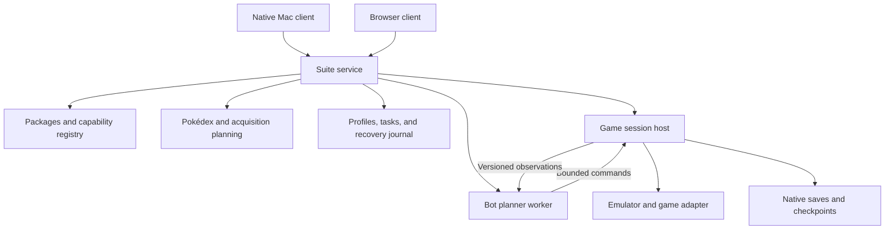

# Suite architecture and update strategy

Research and source audit: September 10, 2026. **Status: implementation underway.**
The package contracts, verified store, revision-aware data, TUF client, update
journal, FireRed planner isolation, session handoff, and native Sparkle integration
are implemented. [Software update guide](SOFTWARE-UPDATES.md) documents their
behavior, validation, and remaining distribution/qualification requirements.
The audit below records the original starting point; it is not a claim that all
39 games now have qualified automation.

## Active scope — September 12, 2026

Development and release qualification focus on the native Mac app. Emulation,
bot execution, saves, ROM-derived artwork, Pokédex and collection management
remain on the Mac. Physical trading uses the existing computer, Linux radio
relay and Archer USB adapter; see [Mac trading](MAC-TRADING.md).

The [iPhone and iPad companion](MOBILE-COMPANION.md) mirrors and controls the Mac
over the local network or Tailscale, including cellular connections. Its sharing
listener belongs to the Mac service and restores the existing pairing on relaunch.
Standalone mobile emulation and [direct USB-radio investigation](MOBILE-ARCHITECTURE.md)
remain paused; their requirements do not gate Mac releases.

The immediate priorities are autonomous FireRed campaign qualification,
reliable collection-to-trade workflows through completed exchange and return
to the lobby, and native Mac usability and distribution. Shared engine and
update boundaries remain reusable without requiring parallel platform work.

## Recommendation and evidence

Keep one repository, a native Mac client, the portable Suite service, and
supervised game processes. Give game integrations, bot logic, and factual data
explicit contracts and independently versioned packages. Preserve a complete
offline installation. Introduce runtime separation incrementally around the
working FireRed engine, then use a second game to test the abstractions.

The architecture should distinguish a reusable task framework from each game's
implementation. Healing, navigation, capture, storage, evolution, and trading
can share lifecycle and reporting contracts. Their actual mechanics, memory
layouts, input timing, and proof of completion remain game-specific.

The implementation began with these foundations and gaps:

| Area | Source evidence | Implication |
| --- | --- | --- |
| Native app lifecycle | [ServiceHost.swift](../macos/Sources/PokemonSuiteMac/ServiceHost.swift) starts the bundled Python service; [desktop.py](../pokemon_suite/desktop.py) resolves bundled engine paths | Bot fixes currently travel with the app; there is no engine package resolver |
| Game catalog | [pokemon_main_series.py](../pokemon_suite/pokemon_main_series.py) defines 39 game identities; several advertised capabilities are inferred from a configured game name | A catalog row or configured emulator is insufficient evidence of automation support |
| Game integration | [installation.py](../pokemon_suite/installation.py) provides FireRed intake; [pokemon_sessions.py](../pokemon_suite/pokemon_sessions.py) manages independent workers | Extend this ownership model and replace title checks behind adapters |
| Bot runtime | [session-worker.js](../engine/firered/src/suite/session-worker.js) owns emulation, observation, decisions, missions, and trades together | Updating the planner currently means replacing its owning game process |
| Pokédex and farming | [pokemon_farming.py](../pokemon_suite/pokemon_farming.py) loads four bundled catalogs; [pokemon_evolution.py](../pokemon_suite/pokemon_evolution.py) and [pokemon_hunt_routes.py](../pokemon_suite/pokemon_hunt_routes.py) cache bundled tables | Data updates need revision-aware loading; task support needs a shared capability service |
| Save integrity | [save-vault.js](../engine/firered/src/suite/save-vault.js) binds immutable state/SRAM blobs to ROM and core identity | Retain this boundary; add package, protocol, and controller-schema identity |
| Later consoles | [suite_desktop_worker.py](../pokemon_suite/suite_desktop_worker.py) reports playback/input and native saves, but no bot, hunt, trade, or emulator checkpoint capability | An instant FireRed-style checkpoint handoff cannot be promised for these adapters |

The architectural references support particular mechanisms, not a claim that
another project's design certifies this application. VS Code demonstrates
separate extension hosts and capability-dependent placement to protect its UI;
that is a useful precedent for containing game and bot workloads.
[VS Code extension host documentation](https://code.visualstudio.com/api/advanced-topics/extension-host)

The main alternatives have different costs:

| Approach | Assessment for this project |
| --- | --- |
| Continue shipping everything only in the app bundle | Simple distribution, but every engine/data change remains tied to app replacement |
| Reload arbitrary modules inside the current game process | Saves a restart but makes cached imports, in-flight inputs, state migration, and failure containment difficult to reason about |
| Versioned packages with supervised process handoff | Recommended: matches existing workers and checkpoints; adds explicit compatibility and recovery work |
| Split into separately deployed network services | Introduces operational and offline failure modes without a demonstrated need for this desktop workload |

The recommended approach is a design judgment based on this repository's
boundaries and the user's update requirements. Its reliability must be proven
by the handoff and gameplay tests below.

## Ownership and module boundaries

This is the target process structure after the bot/host separation stage:

The service owns installation, profiles, task scheduling, package selection,
transaction records, and public APIs. Clients render its capabilities and state;
they do not recreate game rules or determine support independently. Retain
authenticated local HTTP for clients and define versioned JSON contracts for
worker messages. Add generated validators or shared conformance fixtures across
Swift, Python, and JavaScript before changing transports.

Each session host exclusively owns one writable save profile, emulator, input
stream, and frame clock. Use distinct profile/session identities rather than
the title alone so two separately owned copies of the same game can eventually
trade. Changing the selected game only selects a view; an explicit lifecycle
policy determines which workers continue. Resource budgets limit simultaneous
emulation without silently changing another run's requested speed.

The bot worker owns long-lived task decisions and serializable planner state.
The host executes bounded actions and rejects obsolete session IDs, input
ownership generations, and commands based on stale observations. During manual
control, the same input arbiter suspends automation. Bot failure releases held
buttons and pauses execution; the viewer and diagnostic state remain available.

Keep frame-critical execution, RNG timing, and native link transport near the
emulator. Send batched actions with observed boundaries, not a remote RPC for
every frame. Native frame rate, bot speed, and displayed stream frame rate are
separate settings. Measure latency and determinism before extracting the bot
worker; process isolation does not by itself preserve timing.

Retain Python, Node, and Swift initially. A new language, distributed service
stack, or generic plugin marketplace is unnecessary for these boundaries.
Initially accept curated project packages only. A separate process contains
crashes but is not an operating-system sandbox for untrusted downloaded code.

## Packages and compatibility

Expose simple game installation to users while resolving these internal units:

| Unit | Responsibility | Activation boundary |
| --- | --- | --- |
| Native app and host service | UI, service supervisor, package verifier, bundled language runtimes | App update and ordinary relaunch |
| Emulator package | Core/bridge and OS-specific capture, input, audio, and shutdown support | Restart affected host with verified save compatibility |
| Game runtime package | Exact cartridge recognition, memory observer, native ID mapping, low-level controls, artwork readers | Usually affected-host restart |
| Bot package | Shared task machinery plus game-specific story, battle, route, hunt, and recovery policy | Worker handoff when contracts and state schemas permit |
| Data package | Species facts, game-specific dex indexes, encounters, learnsets, evolution predicates, item mappings | Revision swap for browsing; pin or explicitly migrate active tasks |
| Competitive rules package | Target title, format, ruleset, dated recommendations, source provenance | Independent data update; existing requests retain their approved requirements |

Packages declare their ID, version, schema versions, supported platform/CPU,
required host/protocol ranges, dependencies, content digests, provenance, and
supported cartridge revisions. The installer resolves an exact dependency graph
and stores a run lock containing those exact identities. Related packages
activate as a compatible set; independent downloads do not imply arbitrary
mixing of versions is safe.

Use semantic versions for published software/API contracts, plus exact content
hashes for reproducibility. A compatible version range selects candidates; it
does not certify save compatibility or behavior. Data also has a schema version
and immutable revision. [Semantic Versioning specification](https://semver.org/)

Cartridge identity must include title/version, language/region, revision, and
full content identity. For applicable consoles, installed game updates, DLC,
and mods also affect that identity. Filename matching may discover a library
entry; it must not authorize memory-based automation. Large-image verification
runs off the UI thread. Game software updates remain separate from Suite
updates and use user-supplied resources.

The resolver installs outside the signed app, under the platform's existing
per-user application data directory. Keep immutable version directories and
run-specific locks. Retain all versions referenced by active runs, rollback
records, or retained checkpoints. Package cleanup and save cleanup use different
retention policies. Do not modify app-bundle resources in place: Apple's
signature seals bundle resources as well as executable code.
[Apple code-signature documentation](https://developer.apple.com/library/archive/documentation/Security/Conceptual/CodeSigningGuide/AboutCS/AboutCS.html)

## One capability model for the whole Suite

Replace separate lists of supported titles with provider declarations,
installation checks, live probes, and qualification evidence. Model support
and current readiness separately. A feature can be implemented and tested yet
temporarily unavailable because a drive is disconnected, permission is missing,
or the player's save has not reached a prerequisite.

Suggested support values are `unimplemented`, `experimental`, and `qualified`;
readiness values are `ready`, `needs-setup`, `blocked`, and `unknown`. Attach a
reason, supported constraints, package identity, and qualification reference.
Unknown data must remain unknown rather than becoming zero or false gameplay
facts.

Capabilities should include individual functions: playback, audio, buttons,
touch, memory telemetry, native save, emulator checkpoint, navigation, battle,
PC operations, each capture method, evolution methods, and each trade adapter.
Campaign support is a separate qualified scenario, not an implication of
`battle=true`. Pair capabilities bind both game revisions and link protocols;
belonging to the same generation is only a possible planning filter.

Library, Live, Team, Pokédex, Farming, and Bot Settings consume this same model.
Before Start Hunt, the service verifies every step of the selected acquisition
plan. It can offer a known game route for explanation without claiming an
executor is available. An unavailable action explains the specific missing
step and its setup path rather than displaying an unexplained disabled button.

## Pokédex, assets, and acquisition plans

Maintain a shared factual model with version-specific projections. Distinguish
species, forms, regional dex number, National Dex number, and native game IDs.
An item or species number in emulator RAM is never assumed to be the global
catalog ID. Readers provide explicit mappings.

Preserve the existing four JSON catalogs behind a data-provider interface first.
As coverage grows, compile reviewed factual packages into immutable SQLite
databases with indexes for species, versions, forms, locations, and conditions.
Keep user collections, preferences, requests, and notes in a separate mutable
database. SQLite is designed for embedded application storage and suits this
offline workload. [SQLite usage guidance](https://www.sqlite.org/whentouse.html)

PokéAPI is a useful factual input: it models versions, version groups, dex
entries, version-specific encounters, learnsets, and historical changes. Its
documentation also asks clients to cache requests. Import a pinned snapshot
with provenance instead of querying the public API during a bot's decisions.
Validate exact game behavior against qualified local sources and explicit
overrides; catalog coverage alone cannot prove that every historical mechanic
is complete. [PokéAPI documentation](https://pokeapi.co/docs/v2)

Each game projection distinguishes “represented by this dex,” “obtainable in
this version,” and “reachable from this save.” The selected game determines its
default dex ordering and rules. Browsing can show a newer data revision while
an active task retains its pinned revision until a supported handoff.

Artwork remains a separate local-ROM provider. Package the reader and mapping
metadata, not extracted Nintendo sprites. Key any derived cache by cartridge,
reader version, asset identity, form, palette, and language; record when another
local cartridge supplies a compatible fallback. Inventory of a ROM does not
imply its Pokémon, trainer, item, badge, or model readers are all implemented.
Current coverage is documented in [ROM resources](ROM-RESOURCES.md).

Represent acquisition as a persisted sequence of verified operations: acquire,
equip, level, evolve, transfer, return, save. The current FireRed Umbreon rule
already names Emerald as its evolution game; that route should consume partner
capabilities and both saves' prerequisites, not special-case the UI. Resolve
alternative routes with measured preparation, encounter, capture, travel, and
failure costs. Preserve the user's shiny priority and explicit constraints.

Reserve the required Pokémon and party/box slots across all participating
profiles. A collection goal should preserve requested base forms and existing
copies when deciding whether to evolve. Store the identity and native-save
receipt for every completed acquisition or trade step. A timeout leads to
reconciliation before retry, not an assumption that an externally observed
trade can be undone by restoring a local checkpoint.

Competitive recommendations are optional, dated data with a destination game
and ruleset. Keep historical cartridge legality, destination eligibility, and
competitive recommendations distinct. Missing or stale destination information
is an explicit state. A preset must not silently change an already approved
capture request. The public candidate currently excludes competitive presets;
see [data sources](../DATA_SOURCES.md).

## Updates, hotfixes, and recovery

For full Mac app updates, integrate Sparkle with signed update archives and
the existing save-and-quit lifecycle. Download/stage separately from activation
and prefer installation at ordinary quit. This still updates a built native
application; it is not live Swift code replacement. Verify the app's handling
of postponed quits and unfinished trades before enabling automatic installation.
[Sparkle documentation](https://sparkle-project.org/documentation/),
[update settings](https://sparkle-project.org/documentation/customization/)

For public engine/data packages, use the Python reference implementation of
The Update Framework rather than implementing signing and metadata freshness
rules ourselves. TUF defines trusted roles, signed target metadata, hashes,
expiry, and rollback protection. It verifies distribution; Suite must still
implement dependency resolution, activation, compatibility, and recovery.
GitHub can host immutable artifacts, with a separate static metadata feed.
The current release allowlist remains a source-review mechanism, not a trusted
automatic updater. [TUF specification](https://theupdateframework.github.io/specification/latest/),
[Python reference implementation](https://theupdateframework.readthedocs.io/en/stable/)

Use one durable handoff protocol:

1. Fetch and verify the candidate; resolve dependencies without altering the
   running installation. Installed, verified versions continue working offline.
2. Stage the candidate and validate its contracts against captured observations
   and disposable fixtures. A shadow candidate cannot issue live inputs or
   acquire the real profile's write lock.
3. Request a safe boundary. Drain in-flight actions; release input ownership;
   record why an update is deferred. Frame-critical capture and active linked
   exchanges defer handoff until a verified boundary.
4. Checkpoint native save, supported emulator state, bot state, task commitments,
   RNG context, resource reservations, watchdog history, and exact package graph.
5. Activate the compatible candidate with a new ownership generation. Restore
   its state through a declared migration, perform a health handshake, and
   reconnect clients to the same logical session.
6. Resume and persist an update receipt. If startup fails before game execution,
   reactivate the retained version against the preserved checkpoint. After
   gameplay resumes, use the latest state only when backward compatibility is
   proven; otherwise pause for repair. Do not roll back successful external
   effects or blindly rewind the save.

Reactivating a retained trusted package does not rewind TUF's trusted metadata.
Respect package revocations and the run's state compatibility before allowing
fallback. A failed candidate and its receipt remain available for diagnosis.

Initially step 5 restarts only the affected game worker, keeping the app and
last frame visible. Later, splitting planner from emulator host permits bot-only
replacement without restarting the emulator. Timing-sensitive host changes
still need a host restart.

Not every emulator implements save states; Libretro explicitly makes
serialization optional. The current 3DS/Switch adapter exposes native saves,
not a complete checkpoint. For such integrations, defer host updates until a
verified native save and graceful close, or leave them pending. Never turn a
file copy or screen capture into a claimed restorable checkpoint.
[Libretro core lifecycle and serialization](https://docs.libretro.com/development/cores/developing-cores/)

The service owns the mutable task/update journal; game hosts own their save
blobs. Persist blobs first, then atomically commit their manifest/reference;
reconcile incomplete writes on startup. Do not assume the filesystem and SQL
database share a transaction. Shared-host SQLite WAL can support local readers,
but the live database must not be placed on a network filesystem or synced by
copying its open files. Future phone/remote clients talk to the service and
request explicit export or ownership transfer.
[SQLite WAL constraints](https://www.sqlite.org/wal.html)

## FireRed as the qualification contract

Extract shared behavior only after a scenario is reproduced and covered.
Generalize the principle demonstrated by Surge: task completion depends on
the lifetime of its evidence. Game adapters declare whether evidence lasts
for a frame, battle, map visit, save, or campaign. They define invalidation
events and re-observation. FireRed's numeric temporary-flag ranges remain in
its adapter rather than becoming assumptions for every game.

Maintain stable, preview, and development package channels. Ordinary runs may
apply compatible fixes at safe boundaries. Qualification runs pin their complete
package graph and do not auto-update. A reviewed hotfix records an intervention
and keeps the same run identity; a repaired continuation is not an uninterrupted
full-game pass. The latest FireRed repair verifies the failure class and resumed
run, not complete campaign reliability. [Repair evidence boundary](BOT-RECONCILIATION.md)

Qualification records bind game revision, host OS/CPU, core, runtime package,
bot/data versions, scenario, and evidence. Test:

- Boot, native save selection, frame/audio/input, manual takeover, pause, resume,
  orderly shutdown, and exactly one writable owner per profile.
- Menu/dialogue/navigation failures, resettable puzzles, PC capacity, move
  learning, healing/PP, captures, evolution, and complete linked transactions.
- Restart at each update phase; corrupt packages; incompatible schemas; missing
  storage; stale commands; refused shutdown; expired update metadata; and offline
  launch with an installed version.
- Dataset history, native ID mappings, encounter/evolution predicates, and
  task feasibility using the same provider the UI consumes.
- Long unattended campaigns across fixed reproducible seeds and genuinely new
  random teams; report completion rate, stalls, interventions, and coverage.

Public CI uses synthetic fixtures and redistributable inputs. Full emulator
replays use private local/self-hosted resources. Existing macOS tests and a
checked-in Windows/Linux workflow do not prove live portability. Qualify each
claimed host separately at native game frame rates; keep accelerated bot timing
and presentation quality as distinct tests.

## Delivery sequence

| Stage | Work | Exit criterion |
| --- | --- | --- |
| 1. Explicit contracts | Capability/readiness registry, profile/session IDs, package manifest and run lock; wrap current FireRed code | Existing behavior passes unchanged; all clients report the same actual support |
| 2. Updates without app replacement | Versioned engine/data directories, revision-aware catalogs, verified local pack intake, journaled worker handoff and failed-start recovery | Apply a compatible FireRed fix while the native app stays open, preserving save/team/task; all update failure cases retain progress |
| 3. Public distribution | Sparkle integration, TUF package feed/client, pinned dependencies, signing, release channels, clean-machine setup | A fresh installation verifies and installs only compatible software; native app updates respect save/quit behavior |
| 4. Long-lived emulator host | Separate high-level planner from emulation/input execution; retain frame-critical actions in host | Replace planner with same emulator session and no timing or ownership regression |
| 5. Prove reuse | Register LeafGreen revision differences, then Emerald's different maps/clock/evolution; add Crystal and subsequent game families by capability | Each added capability passes its own scenarios; full campaigns are advertised only after completion evidence |

Artwork readers, Pokédex coverage, and playback adapters can advance alongside
these stages without implying that the story bot has advanced equally. The
first implementation should wrap FireRed rather than rewrite its campaign,
and should preserve its current JSON/vault formats until a separately tested
migration is needed. Engine updates should become routine before attempting
universal bot support across all 39 cataloged titles.

For development, add an explicit mode that selects a tested local engine pack
and requests the same journaled handoff. Do not automatically reload arbitrary
dirty source into a production run. Native UI code still requires compilation;
previews and development builds shorten that cycle but are separate from the
end-user update mechanism.
