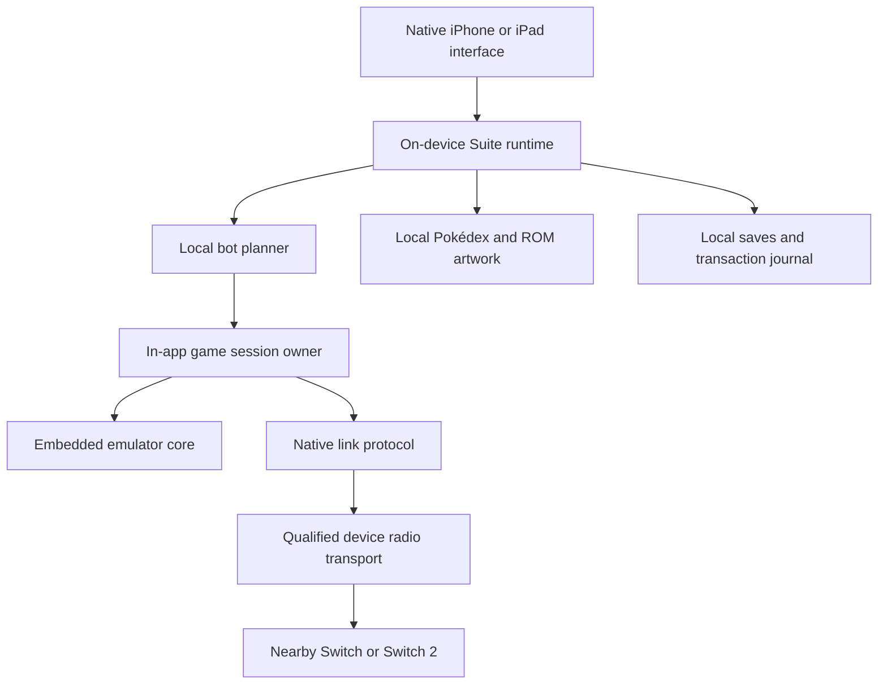

# Mobile architecture and physical-console trading

**September 12, 2026:** standalone mobile emulation and direct USB-radio work remain paused. The [companion](MOBILE-COMPANION.md) is active again as a native remote client of the Mac. The standalone requirements and radio evidence below remain an earlier investigation, separate from companion acceptance criteria.

Requirement, prototype and feasibility audit: September 11, 2026. A FireRed
runtime prototype is now exercised on physical devices; the full mobile Suite
and direct mobile trading are not complete.

## Earlier standalone product requirement

Pokémon Suite must run on its own on iPhone and iPad. The device owns the game,
emulator, bot, frame clock, input, audio/video, ROM asset extraction, Pokédex,
collection, and saves. Ordinary gameplay and automation must not require a Mac,
VM, remote server, cloud model, or connection to another Suite installation.
Trading with a nearby physical Switch or Switch 2 is a primary feature. The
user's existing USB radio adapter is an intended peripheral, subject to actual
platform support. A mobile interface controlling a desktop is not acceptance
of this requirement.

## Current evidence and limits

The Mac integration has real hardware trade evidence. Its transport remains
platform-specific: `engine/firered/src/suite/native-radio.js` spawns SSH and
relays live RFU packets to a privileged Linux helper. The vendored radio stack
uses Linux `nl80211`, AP/monitor interfaces, management frames and packet
sockets. This is more than normal Wi-Fi internet connectivity.

The attached adapter was identified by USB ID `2357:012d`, the TP-Link Archer
T3U. Linux maps that identity to the `rtw8822bu` driver and `rtw8822b_hw_spec`.
Use the USB identity and driver behavior when qualifying hardware; similar
retail adapter names do not establish compatibility.
[Linux driver source](https://github.com/torvalds/linux/blob/master/drivers/net/wireless/realtek/rtw88/rtw8822bu.c)

The standalone profile inspected during this audit has no `nativeRadio`
configuration. Its generic `trade` capability does not distinguish local
emulator linking from physical-console readiness. The worker's physical trade
command still requires the native adapter. This setup and capability distinction
must be resolved explicitly; a generic ready flag is insufficient evidence.

The `native/ios` development app builds, signs and installs on the paired iPhone
17 Pro and M5 iPad Pro. September 10 physical-device tests passed local FireRed bot execution,
pause/checkpoint, app termination/relaunch, and restoration of the saved decision
count. The emulator and campaign planner execute on each device, without a
desktop service or network fetches. Separate fresh device saves are used; the
existing Mac campaign was not moved or restarted. These short tests do not
qualify a whole campaign, thermal performance, audible output, or a trade.

On September 11, build 0.1.0 (2), containing the current shared campaign code,
installed on both devices. All five runtime tests and three native storage
tests passed. The iPhone app launched directly and reported a local emulator
initialized without an error. This build's full device UI checks remain
unverified: the iPhone XCTest runner timed out enabling automation on two
attempts; the iPad test was cancelled while waiting for device unlock. The iPad
adventure was backed up before updating. Desktop collection/save import is not
implemented in this mobile prototype.

The separate DriverKit USB descriptor probe also builds, signs and installs on
the M5 iPad. The hardware descriptor result is still pending: installation is
not a successful USB transfer. No new physical-console trade was performed.
Historical successful trades remain evidence for the Mac/Linux setup only.

## Device feasibility

| Target | Local emulator and bot | Direct existing Archer T3U |
| --- | --- | --- |
| iPhone | FireRed local prototype tested on iPhone 17 Pro | No supported general USB-driver route identified on stock iOS |
| iPad with M-series chip | FireRed local prototype tested on M5 iPad Pro | Signed descriptor probe installed; no supported USB Wi-Fi driver path established |
| iPad without M-series chip | Shared iOS target exists; hardware not tested | Outside Apple's documented DriverKit hardware support |

Apple documents USBDriverKit for macOS and M-series iPads, with device interface
and endpoint access. That permits limited USB access experiments; it does not
establish support for a Realtek Wi-Fi driver or Linux networking stack. Distribution
also needs the applicable Apple-granted entitlements. The paired M5 iPad Pro
meets the documented hardware condition; the paired iPhone 17 Pro does not gain
DriverKit support by having USB-C.
[USBDriverKit](https://developer.apple.com/documentation/usbdriverkit),
[iPad drivers](https://developer.apple.com/documentation/driverkit/creating-drivers-for-ipados),
[driver entitlements](https://developer.apple.com/documentation/driverkit/requesting-entitlements-for-driverkit-development)

The DriverKit guide explicitly excludes USB devices communicating wirelessly
over Wi-Fi or Bluetooth from DriverKit support. Its suggested kernel-extension
alternative is not an iPad app deployment path. A signed USB descriptor probe
must not be interpreted as evidence that a supported Wi-Fi driver can follow.
No documented direct radio path for this adapter has been established on either
mobile device.
[DriverKit device restrictions](https://developer.apple.com/documentation/driverkit/creating-a-driver-using-the-driverkit-sdk)

Apple now permits DriverKit **development** entitlements for paid developer
accounts, including automatic provisioning. The probe uses the documented USB
development wildcard entitlement, with matching restricted to `2357:012d` in its
driver personality. This allowed an actual signed build without waiting for
distribution approval. Distribution entitlements remain a separate requirement.
[Apple DTS development guidance](https://developer.apple.com/forums/thread/809202),
[development provisioning](https://developer.apple.com/help/account/provisioning-profiles/create-a-driverkit-development-provisioning-profile/)

The iPhone's supported accessory and Wi-Fi APIs do not establish compatibility
with the existing radio. Apple describes iAP3/ExternalAccessory as a route for
purpose-built accessories on iPhone; the Archer is not such an accessory.
Wi-Fi Aware is another supported peer protocol, but the current Nintendo link
uses LDN/Pia and cannot be treated as Wi-Fi Aware merely because both are local
wireless. These observations do not prove that no future solution can exist;
they mean there is no verified software-only route with this dongle today.
[Apple accessory guidance](https://developer.apple.com/forums/thread/793915),
[iOS Wi-Fi APIs](https://developer.apple.com/documentation/technotes/tn3111-ios-wifi-api-overview)

The normal sideloaded UTM and UTM SE builds list no USB passthrough. Exceptional
TrollStore/jailbroken configurations are not a basis for ordinary device support
or this native app architecture.
[UTM installation matrix](https://docs.getutm.app/installation/ios/)

## Runtime architecture

Keep shared behavior contracts and use platform-specific execution adapters:

1. The first prototype embeds the existing mGBA WebAssembly core and JavaScript
   campaign in a local WKWebView, with SwiftUI controls and native audio/storage.
   This reuses the real policies while removing Node/server dependencies. A
   native C core remains the next candidate if benchmarks or link integration
   require it; this prototype is not a claim that that C port is complete.
   Preserve
   observation, input, native-save and RFU hooks. Native input/audio/rendering
   and lifecycle code belong to the app. Benchmark real hardware without relying
   on JIT entitlement or desktop capture helpers.
2. Extract the existing bot's portable decision logic behind bounded observation
   and action contracts. A bundled JavaScriptCore implementation is a candidate
   for retaining JavaScript policies; Node imports, filesystem calls, child
   processes, workers and module loading must be replaced or adapted explicitly.
   The prototype bundles the portable campaign, observer and emulator controller
   with browser-compatible crypto, Buffer and deep-comparison dependencies.
   It does not attempt to run the Node worker unchanged on iOS.
3. Implement the same ownership, input generation, save receipts, data revisions
   and update journal inside the mobile sandbox. Threads/queues replace desktop
   subprocesses where required. Preserve compatible native saves; do not assume
   emulator checkpoints transfer across different core builds.
4. Separate the link protocol from USB, clocks, socket APIs and desktop SSH.
   Qualify `trade.local` and `trade.switch` independently for each game, revision,
   device and transport. Missing radio support must not block local gameplay or
   be reported as a working physical trade. These identifiers are proposed
   contract changes, not fields already exposed by the current service.
5. Keep the full trade routine: identity selection, acceptance, exchange, native
   save barriers, no-more-trades response, normal room exit and durable receipt.
   If the outcome becomes uncertain, reconcile the latest state before retrying;
   never rewind a completed external trade or declare success at the animation.

App suspension is a mobile lifecycle event, not a desktop worker crash. Preserve
the game and bot locally; protect active exchanges, and show unresolved outcomes
honestly after an interruption. Do not promise an indefinitely running bot while
iOS suspends the app. Package verification remains shared, but mobile executable
and driver installation must use the platform's supported signing/distribution
mechanisms; the Mac's downloaded engine ZIP is not an iOS runtime installer.

## Next qualification work

Run two bounded investigations alongside the local runtime port:

- **M-series iPad:** the existing descriptor probe may establish limited adapter
  access, but first resolve Apple's documented USB Wi-Fi restriction before
  treating a full custom radio driver as a supported implementation plan. A
  qualified transport would then need firmware/endpoint access, raw transmit
  and receive, LDN discovery, association, and a complete saved exchange on each
  console. USB enumeration alone is not trading support.
- **iPhone:** resolve a supported direct transport before claiming the premier
  feature works. The existing adapter currently has no supported driver path.
  A different purpose-built radio accessory would be a hardware scope change
  requiring the user's agreement; it must not silently become a desktop gateway
  or move the emulator/bot off the phone.

The first prototype establishes local FireRed boot, bot execution and save/reload
on both physical devices. Manual control, audio listening, longer performance
runs, interrupted lifecycle recovery and an explicit disconnected-device check
still need their own qualification. Follow
with the real trade test, including timeouts before acceptance, unplug during
exchange, interrupted app lifecycle, final save/exit, and reconnection without
duplicate transfers. Other games require their own measured core and link
support; the catalog is not a performance or compatibility guarantee.

Build and test instructions are in [the mobile prototype guide](../native/ios/README.md).
