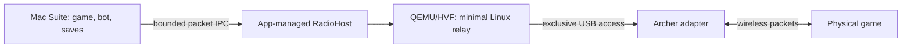

# On-demand Mac wireless radio appliance

Research date: 11 September 2026; implementation update: 12 September. The [hardware prototype](../native/radio-appliance/README.md) progressed to app integration and one [completed physical Switch 2 trade](RADIO-RELAY-INTEGRATION.md#completed-physical-lightweight-exchange), including save and room-exit verification. UTM remained stopped. Production packaging and broader hardware/recovery qualification remain outstanding; the architecture below separates those release gates from this local success.

## Recommendation

Package a headless QEMU/HVF host and a purpose-built Linux radio image with Pokémon Suite. Start it only for physical wireless trading, then shut it down after the verified exchange and room exit. Users should not need to install or operate UTM. Keep emulation, the bot and authoritative saves on the Mac, as the current route already does.

Build the guest from pinned sources using Buildroot. It needs the Linux wireless stack, the adapter driver and firmware, Python and the existing patched relay dependencies. Buildroot can generate the kernel and root filesystem and provides dependency, size and license reporting; builds run on Linux, potentially in CI. [Buildroot manual](https://buildroot.org/downloads/manual/manual.html)

## Baseline and budgets

The existing Apple Silicon UTM configuration assigns two virtual CPUs and 2,048 MiB of RAM to an Ubuntu guest. Its qcow2 currently occupies 3,463,200,768 allocated bytes, approximately 3.46 GB. It also configures a display, shared networking, clipboard and directory sharing. Guest RAM allocation is not the same as total host process footprint.

| Resource | Initial appliance budget | Qualification |
| --- | --- | --- |
| Guest RAM | 512 MiB | Test 256 MiB only after the larger configuration is reliable |
| Virtual CPUs | 1 | Compare with 2 under active trade and host load |
| Total host memory | Aim below 1 GiB during trading | Measure helper, QEMU and any USB redirection process together |
| Compressed download | Aim for 100–200 MB | Measure complete host binaries, kernel, firmware and runtime |
| Cold readiness | Aim for 10–15 seconds | Include adapter capture and radio initialization |
| Outside trading | No VM process | Shutdown, rather than suspend with memory retained |

These are engineering targets, not measured results. USB reliability and protocol deadlines take precedence over the smallest configuration.

## Why QEMU for this Mac

The inspected Mac runs macOS 26.4.1. Apple's direct physical USB passthrough class declares macOS 27.0 availability in its documentation metadata, and it is absent from the installed SDK. Earlier virtual USB controllers and storage devices do not provide the same capability. Apple Virtualization is a possible later backend, not the current implementation path. [Apple USB passthrough documentation](https://developer.apple.com/documentation/virtualization/vzusbpassthroughdeviceconfiguration), [official availability metadata](https://developer.apple.com/tutorials/data/documentation/virtualization/vzusbpassthroughdeviceconfiguration.json)

QEMU already underlies the working UTM route. A minimal build can omit the graphical frontend and unrelated hardware. Retain hardware acceleration on Apple Silicon and the USB controller required by the adapter. Qualify direct libusb USB passthrough first. If that cannot reproduce the established radio behavior, evaluate an app-managed usbredir helper using the same redirection approach as the existing VM, without the UTM interface or display service.

Direct USB access is the first feasibility gate. libusb's Darwin implementation has entitlement and authorization handling for capturing a device from a kernel driver; compiling QEMU with libusb is not proof that a signed app can reliably capture this adapter. Verify signing, capture, resets, reconnects and release on the supported macOS versions. [QEMU USB documentation](https://www.qemu.org/docs/master/system/devices/usb.html), [libusb Darwin implementation](https://raw.githubusercontent.com/libusb/libusb/master/libusb/os/darwin_usb.c)

Bundling the existing Ubuntu disk retains unnecessary software and local private data. Docker/Colima still adds a VM and does not resolve the adapter requirement. A native Mac wireless-driver port would be a separate, substantially less proven project.

## Guest contents and transport

Start with the known-working kernel/driver behavior, then trim against tests. The local adapter identifies as USB `2357:012d`, supported by the RTL8822BU driver. Include USB, cfg80211/mac80211, rtw88/rtw8822bu, required firmware, netlink and TAP support. Match hardware identity rather than relying only on its retail name. [Linux driver source](https://github.com/torvalds/linux/blob/master/drivers/net/wireless/realtek/rtw88/rtw8822bu.c)

Use direct kernel boot, a compressed read-only root filesystem and temporary writable runtime directories. Exclude the desktop, GPU, audio, shared folders, clipboard, general package manager and permanent SSH server from the final appliance. Preserve only configuration that actually needs persistence on the Mac.

The local relay source is `master-red-research/native/radio`. It depends on the patched `Decryptu/frlg-ldn-trade` transport pinned at `d68be4d1985a9b9cad5d881e9b1221b8cbe76037`, including LDN and Python dependencies. Inventory its runtime imports before pruning. Preserve the Realtek compatibility patches and established six-player LDN capacity. Upstream LDN needs Linux wireless facilities including AP/monitor support; ordinary host Wi-Fi access is not a substitute. [LDN project](https://github.com/kinnay/LDN)

Replace the fixed-address SSH command in `engine/firered/src/suite/native-radio.js` with a transport abstraction. Keep SSH available for an external Linux relay. The integrated backend should use virtio-serial connected to a private Unix socket, carrying the existing bounded JSON packet/status protocol. This removes the guest IP, SSH keys and host routing dependency. Keep QEMU management on a separate private control socket. The initial bring-up image may temporarily retain SSH for diagnosis.

Provision user-supplied protocol credentials into guest temporary storage over private IPC. Never embed them in the image, source release, logs or command-line contents. The game and save must remain owned by the current Mac session.

## Lifecycle and efficiency

RadioHost should own one guest and one adapter lease. Starting a game or opening Suite must not boot it. A trade request starts the radio and verifies its health before creating a lobby; merely browsing inventory does not require it. Trading can show concise states such as Starting radio, Connect adapter, Ready, Trading and Finishing.

Preserve the existing exchange guard. Pre-exchange cancellation can exit normally; an accepted exchange must finish saving and the native disconnect/room-exit handshake before the radio shuts down. A stalled or crashed exchange becomes unresolved, not an automatic retry or an assumed successful trade. An idle timeout must never interrupt an active exchange. Normal app quit should defer shutdown until this protected work finishes; crashes need explicit recovery state.

Use private sockets and process identity checks to prevent duplicate guests. Parent loss should close the packet channel, record an interrupted outcome where possible, and clean up the guest and USB lease. Do not create a login service. Once the trade workflow has ended, shut down rather than suspend.

The current relay has a 2 ms polling sleep, making idle wakeups an optimization candidate. Replace polling only with readiness waits and deadline-aware scheduling. Its fractional 59.727 Hz peer tick timing has already needed drift corrections: indiscriminately increasing sleeps or coalescing packets risks breaking trades. Measure timing tails under CPU pressure, not just average idle CPU.

## Packaging and updates

Ship signed/notarized Mac executable helpers through the app's normal update path. Build an architecture-specific guest pack containing the kernel, root filesystem, exact relay version and compatibility metadata. Pin the host/guest protocol and matching driver/relay versions for each trade. Activate updates only while the radio is off, with the previous working pack available for rollback.

The existing package store does not yet accept a radio component: its kinds are engine, planner, data, game and emulator. Add an explicit radio kind and compatibility validation rather than disguising the appliance as an emulator. Also account for the current 128 MiB per-file and 512 MiB installed-package limits; a root filesystem may require a deliberate, tested schema extension or bounded chunk representation. This integration remains implementation work.

For the simplest installation, bundle the initial radio pack in the Mac distribution; offer an optional pack download if keeping the base app smaller becomes a priority. Both should use the same verified artifact. Preserve the stopped UTM disk locally as a fallback, not a release input.

Inventory and fulfill each component's distribution terms. QEMU is principally GPLv2; the inspected trade transport is AGPLv3 and its LDN dependency GPLv3. Include the required corresponding source, patches, build configuration and notices. Review the actual firmware redistribution terms before bundling it. Do not label the combined appliance entirely MIT or include user ROMs, saves or console keys. Buildroot's legal-info output assists this review but does not complete it automatically. [QEMU licensing](https://www.qemu.org/docs/master/about/license.html), [Buildroot license tooling](https://buildroot.org/downloads/manual/manual.html#legal-info)

## Implementation gates

1. Inventory the pinned runtime and licensing; build a signed minimal USB host proof. Confirm capture, packet support and release with the actual adapter. Leave the old VM unchanged.
2. Build a separate 512 MiB guest and run existing relay/peer/transport tests. Verify reproducible artifacts and readiness reporting before changing the live app.
3. Exercise repeated cold starts, hotplug, cancellation, relay loss and host load. Record memory, CPU, boot time and protocol timing. Preserve save ownership and uncertain-outcome guards.
4. Complete a real trade through receipt, both games saving and normal room exit with a participating Switch. Repeat for Switch 2 before claiming qualification there. A connection check or received Pokémon alone is insufficient.
5. Integrate app lifecycle and signed pack updates, then test rollback and interrupted startup. Only then compare 256 MiB and lower-footprint variants against the qualified baseline.

The initial research did not run a replacement VM. The subsequent [prototype results and reproduction instructions](../native/radio-appliance/README.md) record successful direct USB hardware checks using a small guest and a locally signed, relocatable QEMU host. Those initial probes alone did not establish trading. The later integration record now documents one complete physical exchange in the installed app; production release qualification is still incomplete.

The next implementation stage is recorded in [Integrated Mac wireless relay](RADIO-RELAY-INTEGRATION.md): bundled guest, automatic UI readiness, local packet channel and synthetic lifecycle validation. Physical exchange qualification remains outstanding.
